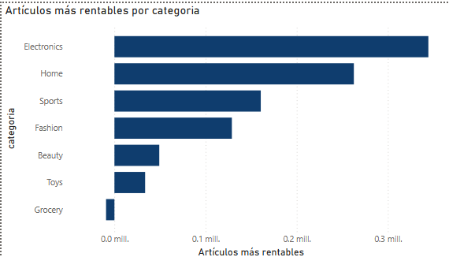
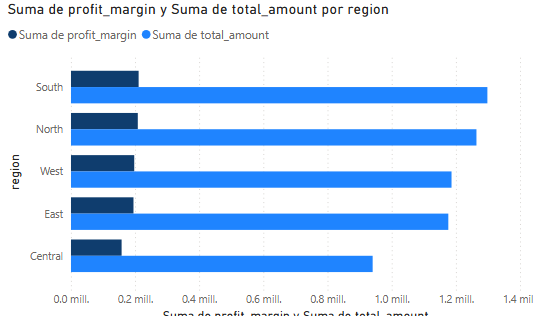
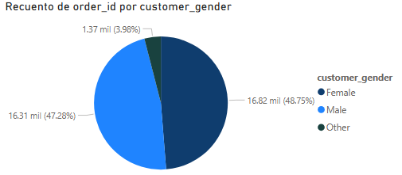

# Descripción

1.	¿Cuáles son las categorías de productos más rentables?
•	La categoría Electronics es la más rentable, seguida de Home y Sports 
•	Las categorías Grocery y Toys presentan los menores márgenes de ganancia

La empresa debe enfocar sus estrategias de promoción y ventas en las categorías más rentables y analizar posibles mejoras en las menos rentables.

2.	¿Cómo varían las ventas y la rentabilidad según la región?
•	La región North registra el mayor volumen de ventas y rentabilidad.
•	Las regiones East y West tienen ventas y rentabilidad menores.
•	Se observa que algunas regios con altos niveles de venta, no necesariamente tienen la mayor rentabilidad.

Es recomendable explorar las razones detrás de la rentabilidad en cada región y corregir oportunidades de mejora.

3.	¿Cuál es el perfil demográfico de los clientes (edad y género)?
•	La mayoría de los clientes son del género Female, seguidos por Male, siendo Other el menos frecuente.
•	El grupo de edad más representativo está entre los 30 y 49 años, aunque hay clientes desde menos de 20 hasta más de 60 años.
•	Los segmentos de género y edad pueden variar según la categoría de producto y la región.

El perfil demográfico revela que el público objetivo principal son mujeres adultes jóvenes y de mediana edad, este dato puede orientar campañas de marketing, selección de productos y comunicación personalizada.

